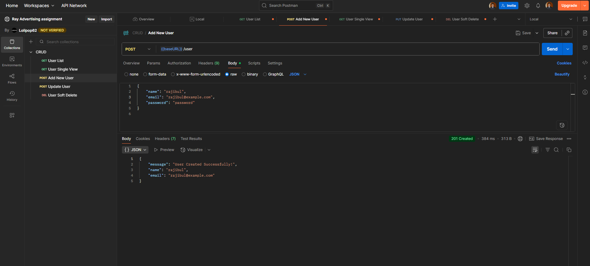
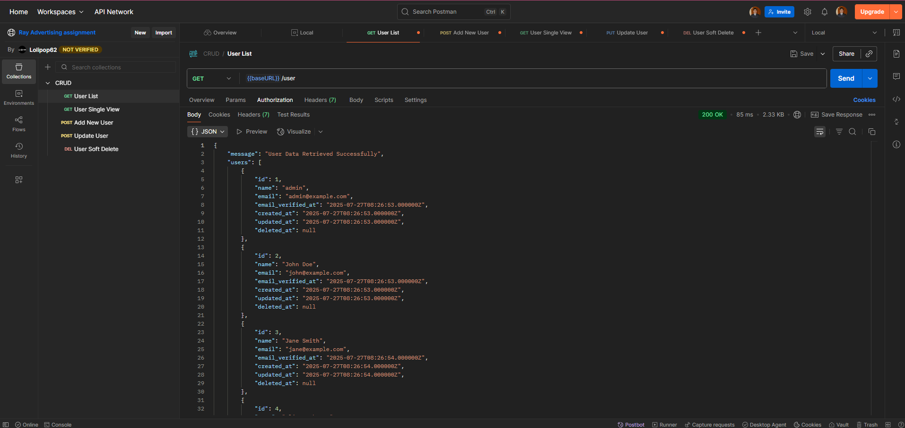
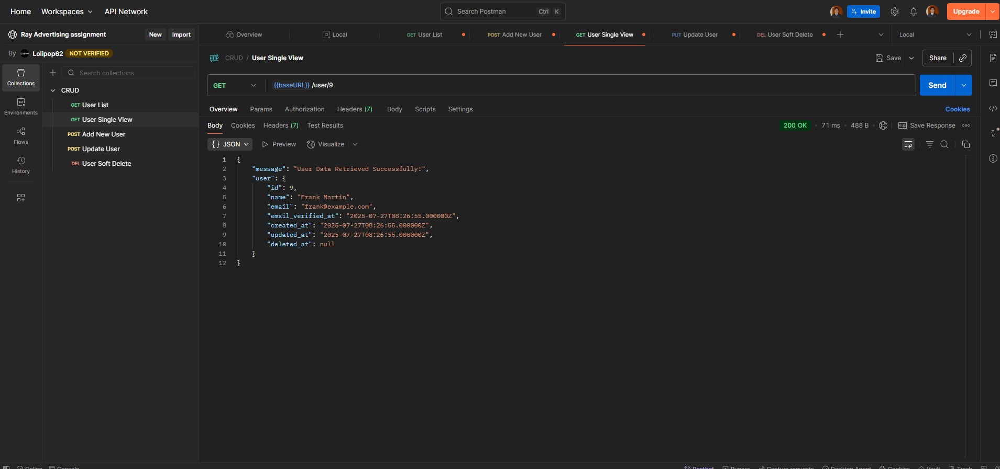
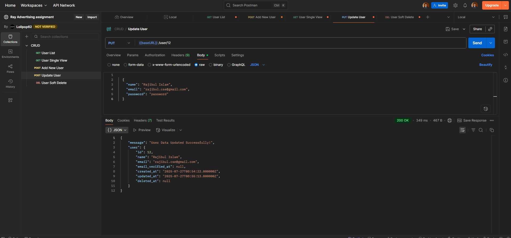

<h1 align="center">CRUD Operation REST API</h1>
<h5 align="center">Assignment from Ray Advertising</h5>

Laravel Framework, Mysql, Postman

<h3>Project Setup Guideline</h3>

<b>Step-1 :</b> At first you should clone the repository. Create a new directory, open comand prompt there and paste the command: <b>git clone https://github.com/rajibul16103404/simple-crud-in-REST-Laravel-Api.git</b>

<b>Step-2 :</b> You must need mysql database. For local you can install <a href="https://www.apachefriends.org/download.html">xampp</a> or <a href="https://www.wampserver.com/en/download-wampserver-64bits/">wampp</a>

<b>Step-3 :</b> Open the terminal in the directory where you cloned the repository and run the following commands:

<h4><b>php artisan migrate</b></h4> 
(If it says database not found create one then type yes and press enter.)

<h4><b>php artisan db:seed</b></h4>
<h4><b>php artisan serve</b></h4>

<b>Step-4 :</b> Open Postman in your web browser or app (in case of postman web you need to download <a href="https://www.postman.com/downloads/postman-agent/">postman desktop agent</a>

<b>Step-5 :</b> Import the collection json from postman collection folder in the cloned repository

<b>Step-6 :</b> Hit the request located left side bar and send the endpoint. You will see the data in lower portion.

<h3>Here is some screen shots attached below</h3>
<h6>Create New User</h6>

<h6>List Of All User</h6>

<h6>Single View of User</h6>

<h6>Update Existing User</h6>

<h6>Delete User</h6>

